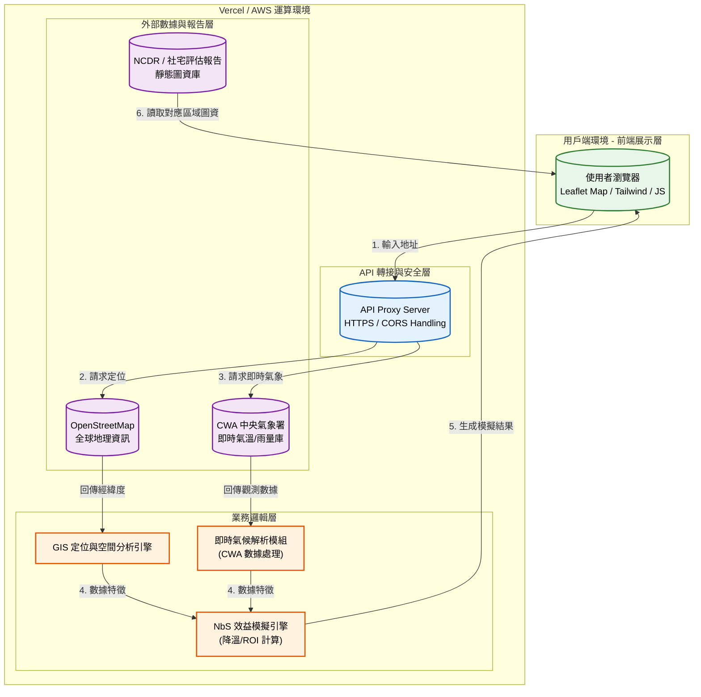

# 碳吉 TanJi：社區微氣候韌性決策平台 🌿

## 1. 專案介紹

### 1.1 系統目的簡介

本系統旨在協助社區管委會與物業管理公司，解決都市熱島效應與極端降雨帶來的居住威脅。透過「宏觀風險快篩」與「微觀 NbS 改造建議」兩大核心功能，整合政府氣象 Open Data 與 AI 計算引擎，提供視覺化的降溫效益模擬與政府補助試算，將複雜的氣候科學轉化為具體的社區改造決策建議。

---

## 2. 系統架構與範圍

### 2.1 系統架構圖

本系統採用 **資料驅動的無伺服器架構** 設計，並區分為用戶端、雲端運算環境與數據層。



### 2.2 系統範圍

* **展示層**: 採用 Leaflet GIS 套件，負責地圖互動、Before/After 效益滑桿與數據儀表板展示。
* **業務邏輯層**: 負責處理地址轉座標、搜尋最近氣象站算法，以及計算不同 NbS 方案（綠屋頂、隔熱漆）的經濟回收期（ROI）。
* **數據存取層**: 核心在於串接中央氣象署觀測 API、OpenStreetMap，以及匯入各縣市低碳社區補助法規。

### 2.3 交付項目

1. **網頁應用程式**: `index.html` (整合 Tailwind CSS, Leaflet JS)。
2. **後端代理函數**: Vercel Serverless Functions 程式碼。
3. **靜態分析圖資庫**: `./images/` 目錄內之區域評估圖檔。
4. **系統規格文件**: 本規格書。

---

## 3. 業務功能需求

本節參照講義之使用案例格式描述。

| 需求編號 | 功能名稱 | 參與者 | 功能描述 | 業務邏輯/備註 |
| --- | --- | --- | --- | --- |
| **FR-01** | **社區地理定位** | 管委會 | 輸入社區地址後，自動定位經緯度並載入地圖。 | 若後端失效，系統支援本地搜尋快取。 |
| **FR-02** | **氣候風險快篩** | 系統 | 即時抓取距離社區最近的觀測站數據，包含氣溫與時雨量。 | 依據 CWA API 資料計算與區域平均值的差異，判斷熱島等級。 |
| **FR-03** | **NbS 模擬器** | 管委會/物業 | 切換綠屋頂、水回收、隔熱等方案，即時渲染模擬效果圖。 | 依據施作面積與物理參數計算建築本體下降溫度。 |
| **FR-04** | **補助與 ROI 試算** | 財務人員 | 輸入社區戶數與預算，試算政府補助金額與電費節省回收年限。 | 內建新北市/台北市低碳社區補助標準公式。 |
| **FR-05** | **行動計畫書匯出** | 管委會 | 將分析結果與照片，一鍵匯出為 PDF/Docx 格式之補助申請書。 | 需包含改善前、改善後模擬對比圖。 |

---

## 4. 非業務功能需求

依據講義「雲端架構設計核心概念」制定。

### 4.1 安全性要求

* **傳輸加密**: 全程使用 **HTTPS** 協定進行資料傳輸。
* **API 負載保護**: 對於外部 API (CWA/OSM) 使用 Proxy 轉接，並實施 Cache 機制減少請求次數以防濫用。
* **資料隱私**: 系統不強制儲存使用者輸入的詳細門牌，僅將座標用於即時計算。

### 4.2 系統效能

* **地圖渲染**: 瓦片地圖載入需在 **3 秒內** 完成。
* **響應式設計**: 支援行動裝置（手機、平板）實地盤點使用。

### 4.3 可用性與準確性

* **服務水準**: 前端託管於高可用性之 CDN (如 Vercel/GitHub Pages)。
* **空間誤差**: 氣象站匹配需精準至距離基地 10km 內之最近站點。

---

## 5. 系統介面設計

### 5.1 API 規格

系統透過代理端點處理外部 API 請求以避免 CORS 問題。

#### 介面 A: 地理編碼轉向 (Geocode)

* **Endpoint**: `/api/geocode?address=新北市三峽區...`
* **輸入**: URL 查詢字串
* **輸出**: JSON 格式

```json
{
  "lat": 24.93,
  "lng": 121.37,
  "name": "新北市三峽區..."
}
```

#### 介面 B: 即時氣候診斷 (Climate)

* **Endpoint**: `/api/weather` & `/api/rain`
* **輸入**: 無 (由伺服器端觸發外部請求)
* **輸出**: 轉發並過濾 CWA API `O-A0003-001` (氣溫) 與 `O-A0002-001` (雨量) 之 JSON 數據。

---

## 6. 專案安裝與部署

### 前置需求

* 現代瀏覽器 (Chrome/Edge/Safari)。
* Vercel 帳號 (用於部署無伺服器函數)。
* 氣象署 CWA API 授權金鑰 (供後端環境變數使用)。

### 部署步驟

1. **圖資準備**: 確保 `./images/` 目錄下存放完整的行政區適宜性評估報告圖片。
2. **後端部署 (Vercel)**:
   * 將專案推上 GitHub。
   * 連結至 Vercel，設定環境變數 `CWA_API_KEY`。
   * 部署 `api/` 資料夾下的 Serverless Functions。
3. **前端設定**:
   * 確認 `index.html` 中 API 呼叫路徑指向您的 Vercel 網域。
   * 開啟網頁即可使用測試。
